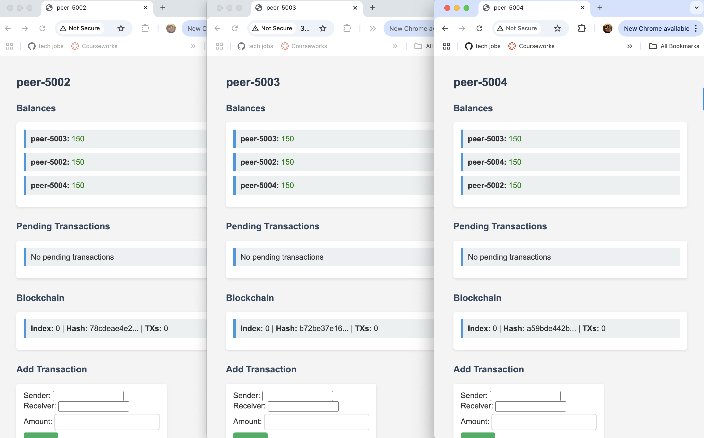
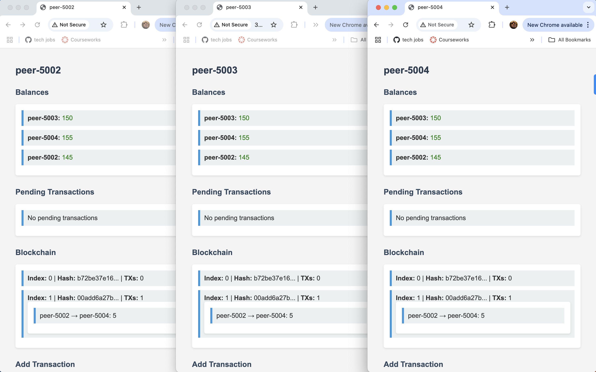
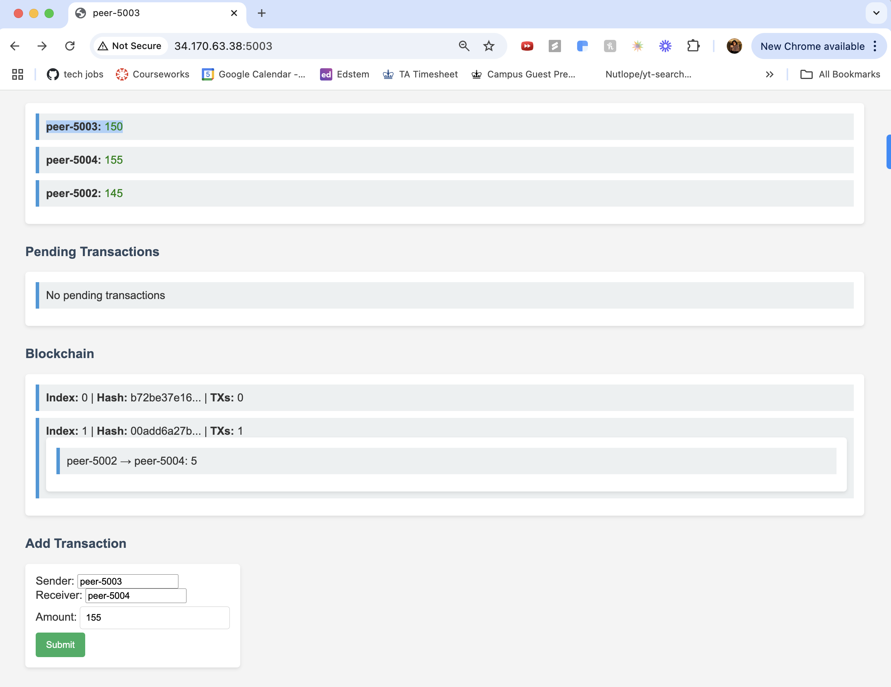
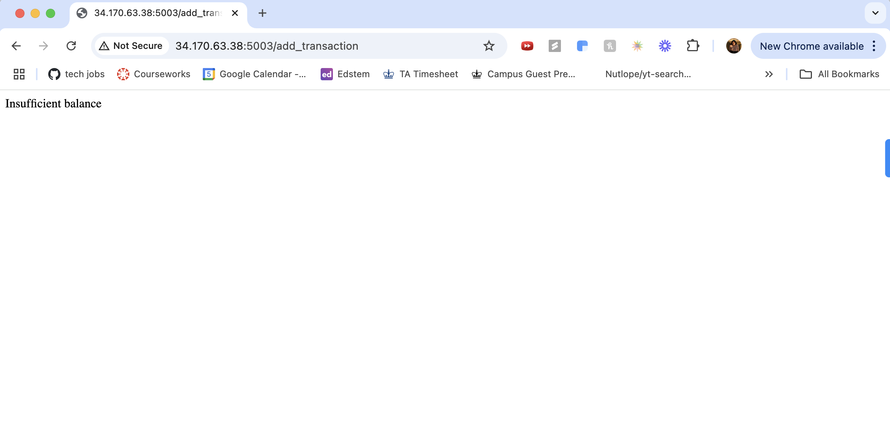
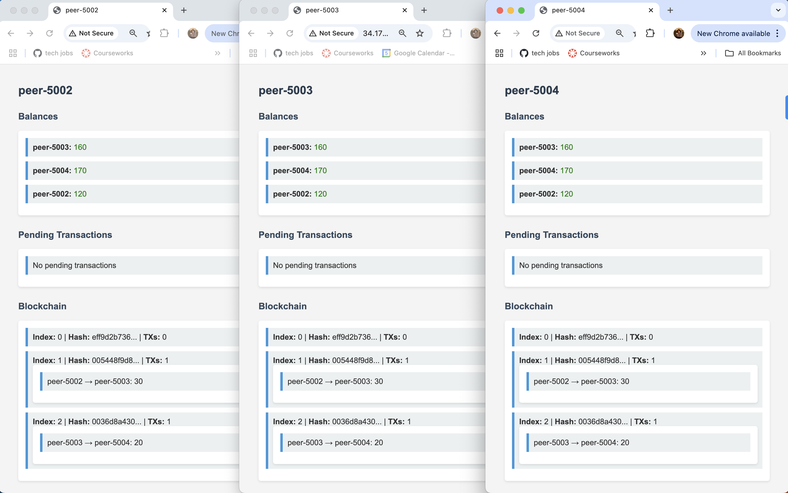
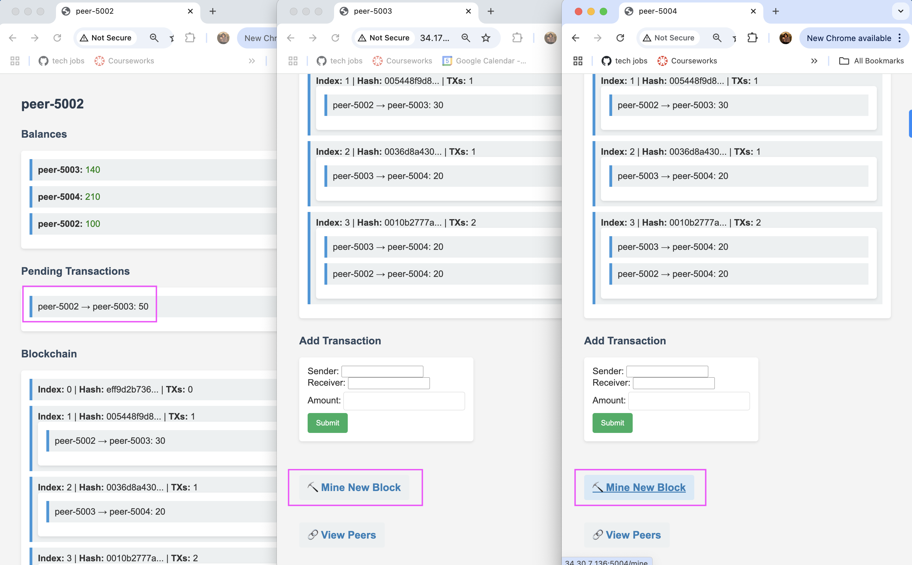
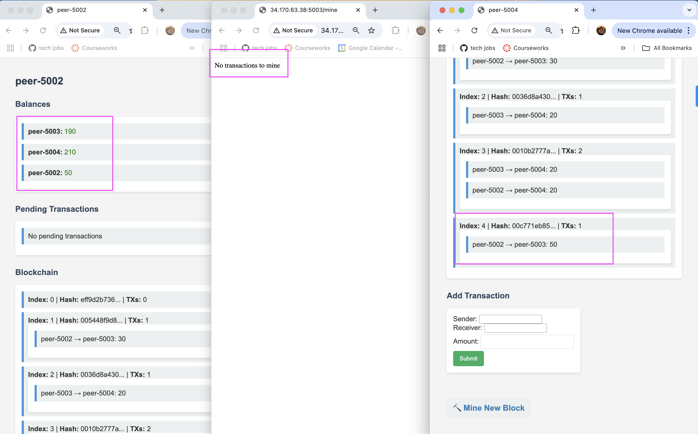

# TESTING.md for Final Project

# Benjamin Vazzana (bav2113), Rhea Charles (rtc2133), Shinjini Mukherjee (sm5160), Shreeya Patel (sjp2236)

# Testing Blockchain Meal Swipe Exchange Application

This document outlines test cases for testing the blockchain system with a focus on meal swipe exchanges. The system allows members to donate up to 150 meal swipes. Additionally, the test cases include scenarios for adding new members to the network.

## Test Cases

### 1. **Test Member Registration and Addition**

**Objective**: Ensure that new members are added to the blockchain system successfully.

#### Steps:
1. Start the tracker and all peers.
2. Connect to the blockchain system through SSH (e.g., Member1).
3. Verify that the new member is correctly registered under `Balances` in the UI.
4. Check the member's balance to ensure it's initialized correctly (150 meal swipes).

#### Expected Result:
- The new member should be added to the system and appear in the list of registered members.
- The member should have a starting balance of 150 meal swipes.

#### Attempted Input:
`python3 peer.py 34.10.23.142 5002`
`python3 peer.py 34.10.23.142 5003`
`python3 peer.py 34.10.23.142 5004`

#### Actual Result:
All peers namely peer-5002, peer-5003 and peer-5004 are added and have a starting balance of 150 Meal Swipes

---

### 2. **Test Meal Swipe Donation (Within Limit)**

**Objective**: Verify that a member can donate meal swipes within the limit of 150.

#### Steps:
1. Start the tracker and peers.
2. peer-5002 donates 5 meal swipes to another member (e.g., peer-5004).
3. Verify that peer-5002's balance is updated to 145 swipes (150 - 5).
4. Verify that peer-5004's balance is increased by 5 swipes.

#### Expected Result:
- peer-5002 should have 145 swipes
- peer-5004 should have received 5 meal swipes, increasing their balance.

#### Attempted Input:
peer-5002 sends 5 meal swipes to peer-5004

#### Actual Result:

---

### 3. **Test Meal Swipe Donation (Exceeds Limit)**

**Objective**: Ensure that a member cannot donate more meal swipes than their balance (150 limit).

#### Steps:
1. Start the tracker and peers.
2. peer-5003 attempts to donate 155 meal swipes to peer-5004.
3. The system should reject the donation due to insufficient swipes.
4. Verify that peer-5003's and peer-5004's balances remain unchanged.

#### Expected Result:
- The system should prevent peer-5003 from donating more than their available meal swipes.
- peer-5003's balance should remain at 150, and no transfer should take place.

#### Actual Result:

---

### 4. **Test Meal Swipe Donation Between Multiple Members**

**Objective**: Test the ability of multiple members to donate meal swipes to each other, ensuring proper balance updates.

#### Steps:
1. Start the tracker and peers.
2. peer-5002 donates 30 meal swipes to peer-5003.
3. peer-5003 donates 20 meal swipes to peer-5004.
4. Verify the balances after the transactions:
   - peer-5002: 120 swipes
   - peer-5003: 160 swipes (after receiving 30 from peer-5002 and donating 20 to peer-5004)
   - peer-5004: 170 swipes (after receiving 20 from peer-5003)

#### Expected Result:
- The balances of each member should be updated correctly after the transactions:
  - peer-5002: 120 swipes
  - peer-5003: 160 swipes
  - peer-5004: 170 swipes

#### Actual Result:
Worked as expected!

### 5. **Test Forking Scenario - Simultaneous Transaction Mining**

**Objective**: Simulate a forking situation where two users try to mine same time, and only one of them is confirmed and accepted into the blockchain, demonstrating the handling of conflicting transactions.

#### Steps:
Steps:
1. Start the tracker and at least 3 peers (peer-5002, peer-5003, peer-5004)
2. peer-5002 creates a transaction sending 30 meal swipes to peer-5003
3. Simultaneously (within 1-2 seconds of each other):
  - peer-5002 attempts to mine the block
  - peer-5004 attempts to mine the block
4. Observe which peer mining gets accepted
5. Verify:
  - One peer is unable to mine the block since the other has already done it
  - Transaction is confirmed and balances are correct
  - Block is added to the Blockchain

#### Expected Result:
- One peer executed the transaction
- Other peer is blocked
- Balance and blockchain is updated appropriately

#### Actual Result:
peer-5003 gets blocked and peer-5004 successfully mines the block.

